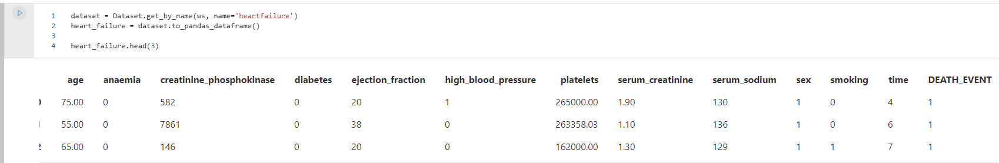
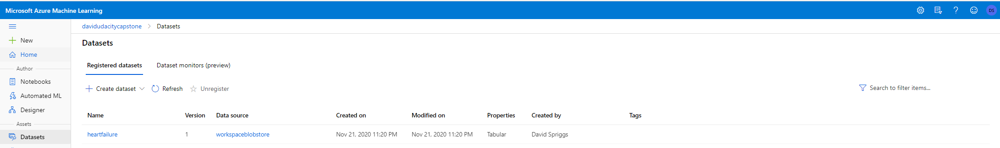
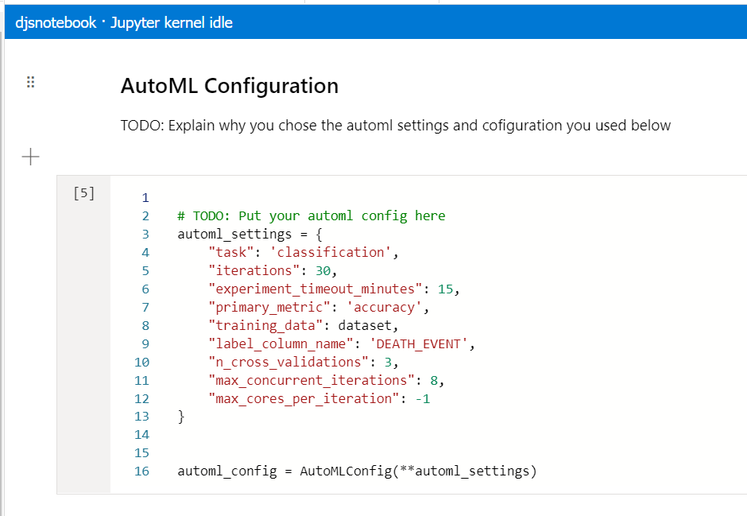
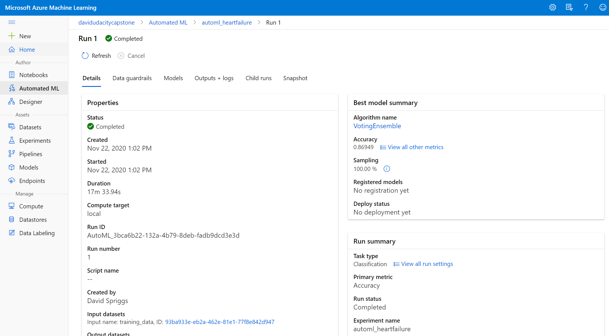
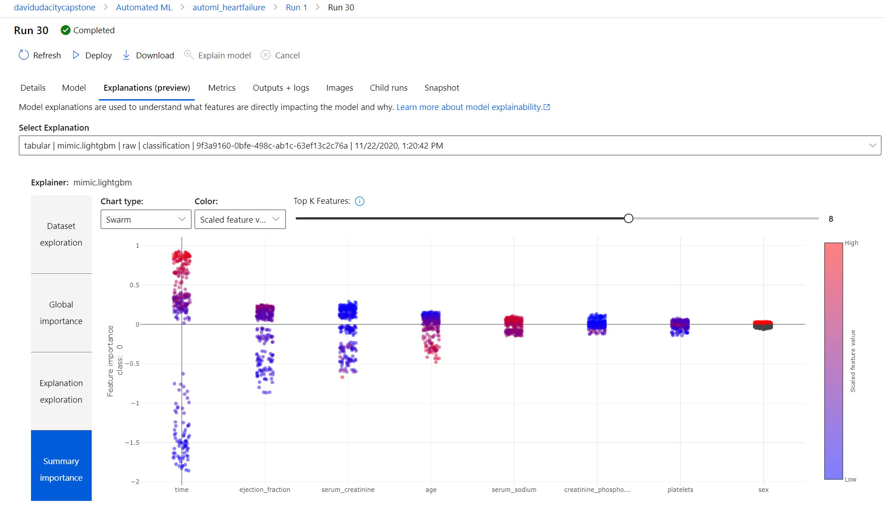
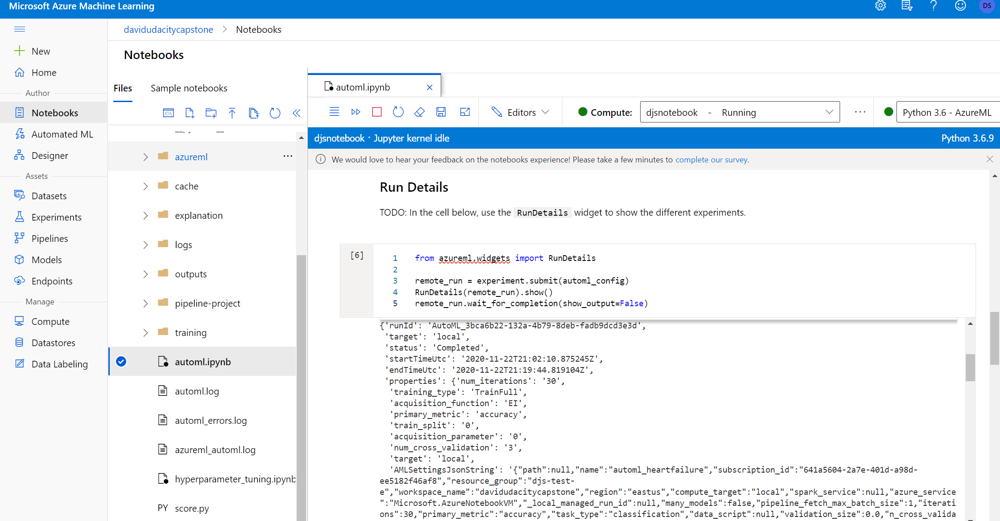
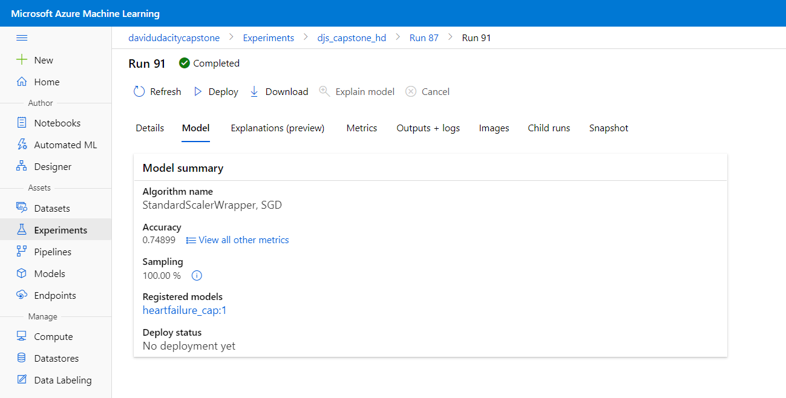
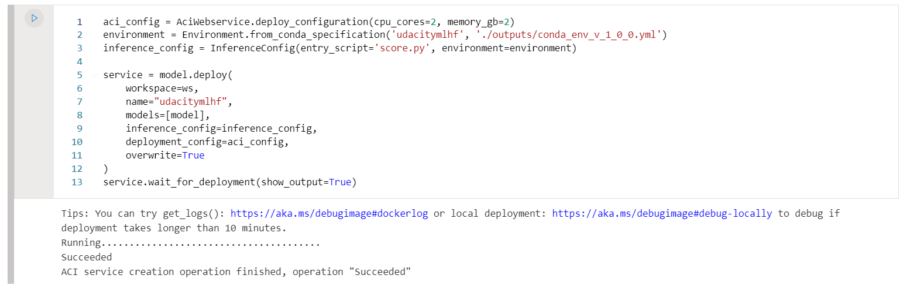
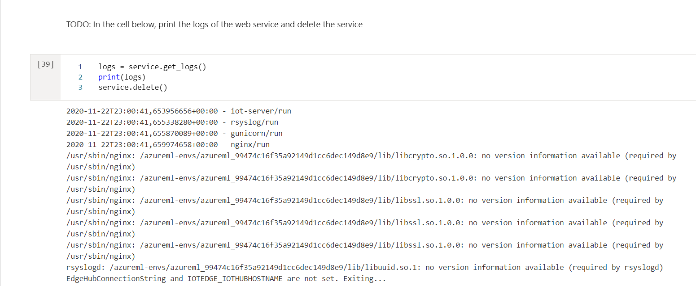

*NOTE:* This file is a template that you can use to create the README for your project. The *TODO* comments below will highlight the information you should be sure to include.

# Heart Failure Mortality

The project will take patient information, as supplied by the <a href="https://archive.ics.uci.edu/ml/index.php" target="_blank">University of California at Irvine</a>, and build a model to predict if a patient will die from heart failure. The technology Azure Machine Learning Services will be used with the power of the AutoML. Though the project provided a choice of AutoML versus HyperParameter Tuning, AutoML was chosen as it enc

## Project Set Up and Installation
Normally, the dataset would be retrieved from Kaggle and the decision was to go to the source University of California at Irvine. The dataset was downloaded and placed in the default datastore for the workspace. 

## Dataset

### Overview
The dataset, as stated in the section "Project Set up and Installation", was retrieved from <a href="https://archive.ics.uci.edu/ml/index.php" target="_blank">University of California at Irvine</a> which is a Machine Learning repository for machine learning analysis. The dataset :
"..contains 76 attributes, but all published experiments refer to using a subset of 14 of them. In particular, the Cleveland database is the only one that has been used by ML researchers.." 

### Task
Predicting the likelihood of a patient will die from heart disease. 

### Access
The data was loaded into the workspace default datastore.

## Automated ML
Though the project provided a choice of AutoML versus HyperParameter Tuning, AutoML was chosen as it encompasses Hyperparameter tuning and a higher accuracy percentage. For AutoML, we chose the following configuration:

The settings used for the exploration of the dataset were chosen to optimize performance and maximize resources.

### Results
The best model generated by AutoML is a VotingEnsemble method.

VotingEnsemble utilizes LightGBMClassifier highlighting Time feature as the most important.

## Hyperparameter Tuning
 Even though the Hyperparameter Tuning model was not chosen. The process and results are included for the sake of completeness. In AzureML we run HyperDrive on two parameters, which are arguably the two most important ones: * n-estimators: the number of estimators, i.e. trees, in the forest. It's in range [50, 300] * max-depth: the maximum depth of each tree, i.e. how many split each tree can perform. It's in range [1, 20]
 
  

## Model Deployment

To deploy the best model found by AutoML we use the AzureML Endpoint. The best model is deployed following this steps:

1. Register the model and download its artifacts
2. Create a <a href="https://www.anaconda.com/" target="_blank">Conda</a> environment with all required dependencies using the artifacts provided by AutoML
3. Define the configurations of the WebService, in this case 2GB of Memory and 2 VCPU are used.
4. Deploy the model to an Azure Container Instance which included the scoring script.
5. Monitor the model using Azure App Insights.

## Screen Recording
<a href="https://youtu.be/BrZcG7U3kW4" target="_blank">Screencast</a>

